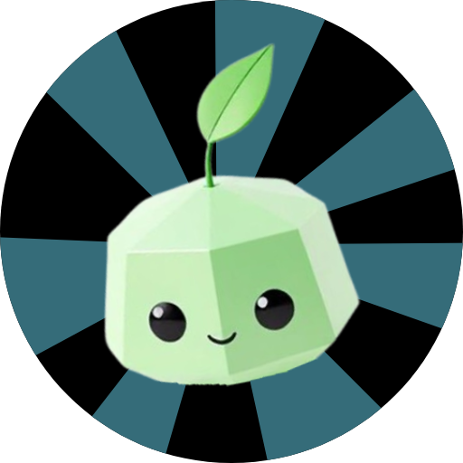
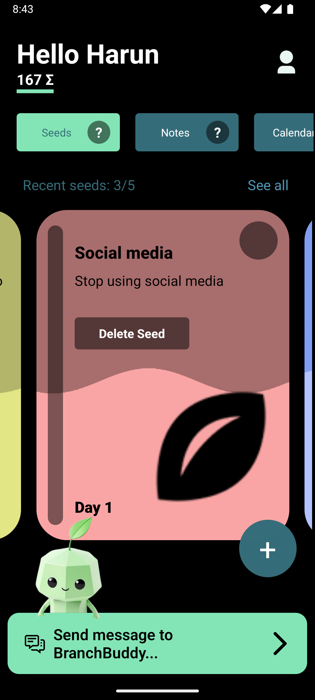
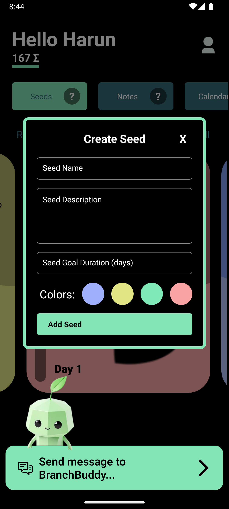
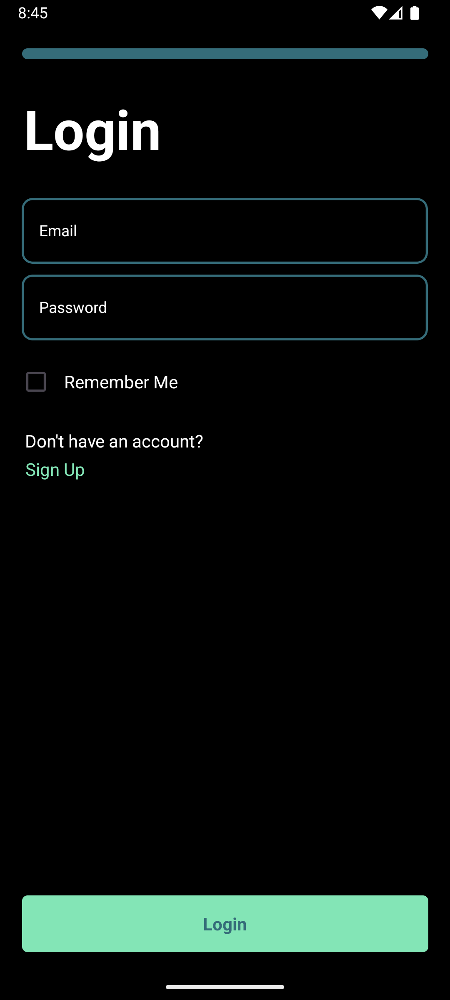
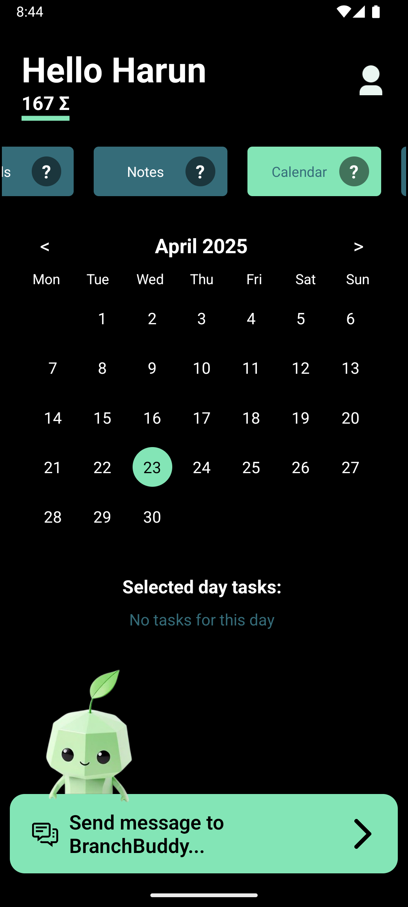
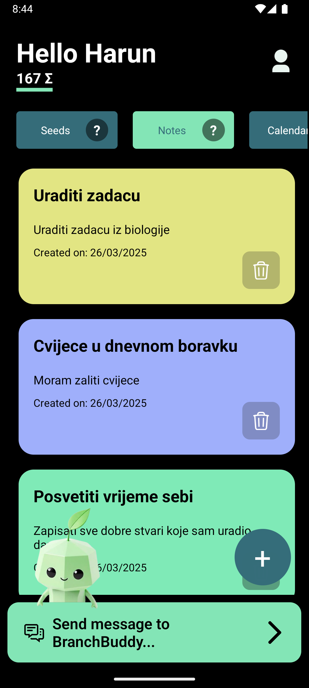
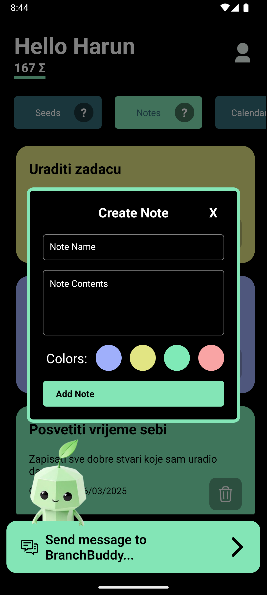
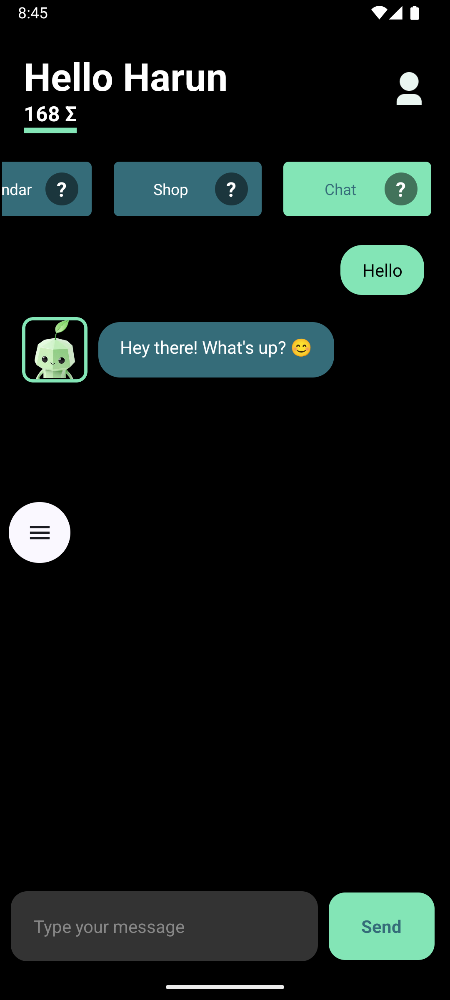
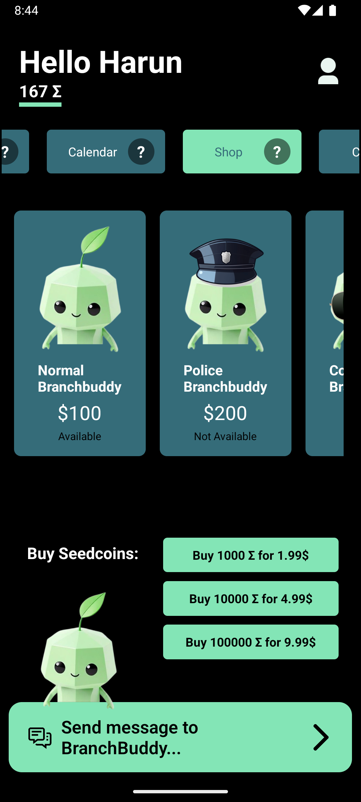

# 🌱 BranchBuddy



**BranchBuddy** is a Duolingo-style self-help app that helps you grow daily through fun, gamified micro-goals called **"Seeds."** With an adorable mascot (also called **BranchBuddy** 🌿), and a fully-featured productivity system, this app is your buddy on the path to becoming your best self.

---

## 🧸 Meet BranchBuddy


Your cheerful, leafy friend **BranchBuddy** is always here to motivate, guide, and celebrate your daily wins!

---

## 📱 Screenshots

| Screen | Preview |
|--------|---------|
| 🌱 **Seeds Screen** |  |
| ➕ **Add Seed** |  |
| ⚙️ **Settings** |  |
| 🔐 **Login** |  |
| 📆 **Calendar** |  |
| 📝 **Notes** |  |
| ➕ **Add Notes** |  |
| 💬 **Chatbot** |  |
| 🛍️ **Shop** |  |
---

## 🛠️ Tech Stack

- 📱 **React Native** – Cross-platform mobile development
- 🔡 **TypeScript** – Type-safe codebase for scalability
- 🔥 **Firebase** – Authentication, Firestore, and hosting
- 🪵 **Firesite** – Static landing page powered by Firebase Hosting
- 🤖 **AI Chatbot** – Integrated smart assistant (OpenAI or similar)

---

## 🧩 Presentations

| File | Description |
|------|-------------|
| [📊 Pitch Presentation](assets/presentations/1.pptx) | Initial concept presentation |
| [🛠 Dev/Tech Stack Presentation](assets/presentations/2.pptx) | Presentation for possible investors in the project |

---

## 🧠 UI Layout in Figma

[](https://www.figma.com/design/DvUyBcEx6ETnsRFGDe05xY/UI?node-id=0-1&m=dev&t=FxIDu4nnl8Gd78Cq-1)

Click the image to view the full UI in Figma.

---

## 🚀 Getting Started

```bash
git clone https://github.com/harunridjevic/branchbuddy.git
cd branchbuddy
npm install
npx expo start
```

> ⚠️ Be sure to set up your Firebase credentials in a `.env` file before running the app.

---

## 🌟 Core Features

- ✅ Track Daily Tasks ("Seeds")
- 💰 Earn and Spend Seedcoins
- 🛒 In-App Shop
- 📔 Notes for Journaling and Ideas
- 📆 Calendar Integration
- 💬 AI Chat Assistant (BranchBuddy)
- 🔐 Secure Login with Firebase
- 🌿 Personalized growth with mascot support

---

## 🤝 Contributing

Pull requests are welcome! Feel free to fork the repo, suggest improvements, or build new features. Open an issue first if you'd like to discuss changes.

---

## 📬 Contact

**Created by Harun Riđević**  
📍 Sarajevo, Bosnia and Herzegovina
📧 [harunridjevic@gmail.com](mailto:harunridjevic@gmail.com)

---

## ⭐️ Show Your Support

Give this repo a ⭐️ if you believe in mental wellness, gamified motivation, and adorable mascots 🌿💚  
Let’s grow, one seed at a time.
